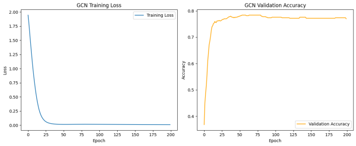
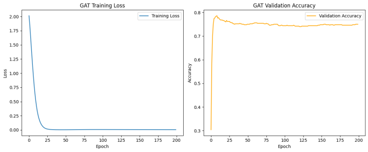

# 🌐 Graph Neural Networks for Social-Network Analysis  
*GCN · GAT · HetGNN*

> Comparative study of three GNN architectures on homogeneous (Cora, Facebook Page–Page) and heterogeneous social graphs.  
> We evaluate **node-classification**, **community detection**, and **embedding quality** to determine which model best suits different social-network scenarios.

---

## 📑 Abstract
Graph Convolutional Networks (**GCN**), Graph Attention Networks (**GAT**), and Heterogeneous Graph Neural Networks (**HetGNN**) are trained and benchmarked on citation and social-media datasets.  
*Key findings*:  
* GCN tops homogeneous graphs (80.4 % accuracy on **Cora**).  
* GAT narrows the gap when relationships vary in importance (attention weighs neighbours).  
* HetGNN handles multi-entity graphs at the cost of lower raw accuracy but captures cross-type semantics invisible to homogeneous models.

---

## 🔍 Datasets
| Dataset | Type | Nodes / Edges | Classes | Features |
|---------|------|---------------|---------|----------|
| **Cora** | homogeneous citation | 2 708 / 5 429 | 7 | 1 433-dim TF-IDF |
| **Facebook Page–Page** | homogeneous social | 22 470 / 171 002 | 4 | 128-dim embeddings |
| *Custom heterogeneous Reddit* | user–post–comment | 14 k / 88 k | 2 (user types) | user metadata, post text |

---

## 🛠️ Methodology
1. **GCN** – 2-layer Kipf-Welling spectral conv (hidden=16).  
2. **GAT** – 8-head attention, ELU, dropout 0.6.  
3. **HetGNN** – GAT (user↔user) + GraphSAGE (user↔post) + GCN (post↔post); mean fuse.  

Training: Adam 0.01, weight-decay 5e-4, 200 epochs (GCN/GAT) or 100 epochs (HetGNN), dropout 0.5–0.6.  
Splits: 70 % train / 15 % val / 15 % test.

---

## 📈 Results

### Node-Classification (test set)

| Model | Dataset | Accuracy |
|-------|---------|----------|
| **GCN** | Cora | **80.40 %** |
| GAT | Cora | 77.80 % |
| HetGNN | Heterogeneous graph | 29.50 % |

### Community-Detection (K-means on embeddings)

| Model | ARI |
|-------|-----|
| GCN | **0.56** |
| GAT | 0.51 |
| HetGNN | 0.21 |

> **Observation:** HetGNN’s embeddings reflect cross-entity relations even though classification accuracy is lower.

---

### 📊 Training & Embedding Visuals

| GCN | GAT | HetGNN |
|---------------|--------------------|------------------|
|  |  |  |

